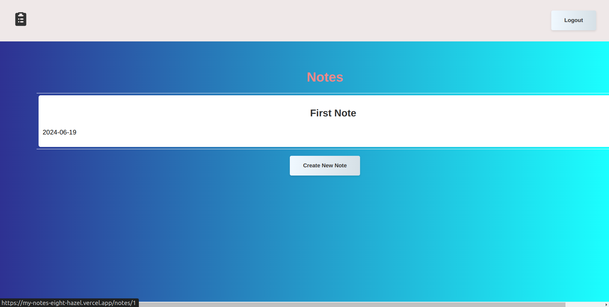
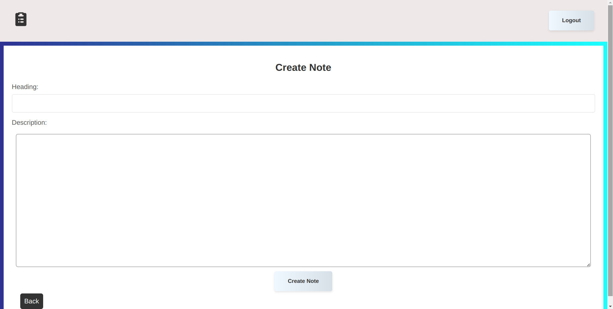
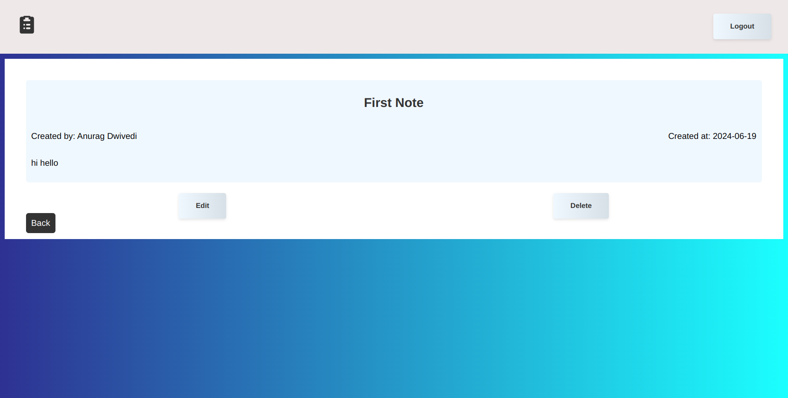
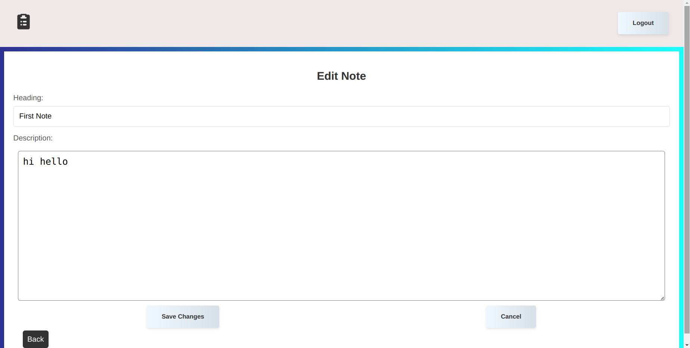

#### Links:
- Backend- [NotesBackend](https://github.com/anuragdw710/NotesBackend)
- Frontend- [MyNotes](https://github.com/anuragdw710/MyNotes/)
- Live - [my-notes](https://my-notes-eight-hazel.vercel.app/)

## Notes Website - A User-Friendly Note-Taking App

## Objective:
- This Django web application provides a comprehensive platform for creating, managing, and searching your notes. It empowers users to streamline their note-taking process and access their information from anywhere.

## Key Features:

- User Authentication:
  - Secure login and registration functionalities ensure authorized access.
  - User accounts allow personalized note management.
- CRUD Operations:
  - Create: Effortlessly jot down new notes.
  - Read: View all your notes or search for specific ones.
  - Update: Edit existing notes to keep them current.
  - Delete: Organize by removing notes you no longer need.
- Search Functionality:
  - Quickly find relevant notes using a powerful search bar.
  - Filter notes based on keywords or criteria for targeted results.
- Intuitive Interface:

  - User-friendly design simplifies note creation and management.
  - Streamlined navigation enhances the overall user experience.

- Technical Stack (Replace with your specific libraries):
  - Django (Python web framework)
  - Django REST framework (API development)
  - PostgreSQL or MySQL (Database)
  - React

## How to Run the Application Locally

To run this application locally, follow these steps:

```bash
# Clone the repository
git clone https://github.com/anuragdw710/MyNotes

# Navigate to the project directory
cd MyNotes

# Install dependencies
npm install

# Run the application
npm run dev
```

## Pages:

- Login page


- Register Page


- Notes List page



- Create Notes page



- Detail Note Page



- Edit note page


